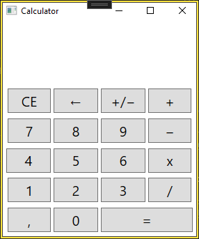
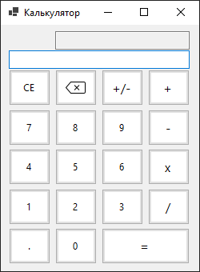

# Calculator (WPF/WinForms)

This is a simple calculator project in WPF/WinForms. The project contains tests to check the correctness of the operations.

## WPF 

## WinForms 

This project was initially made using
- Visual Studio 2022
- .NET 9.0
